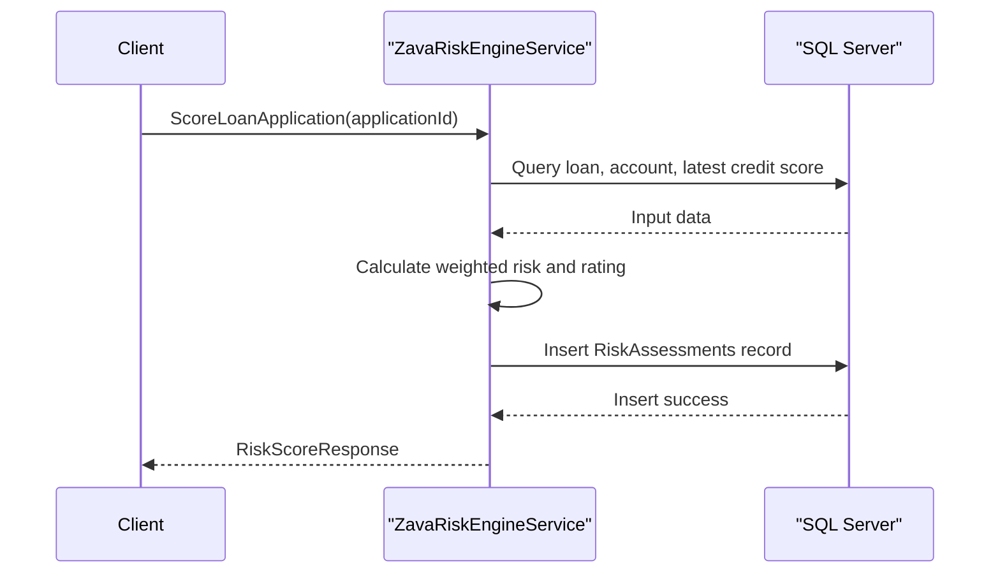

# API & Service Communication Contracts

The application exposes a SOAP-based API through a single WCF service contract plus a lightweight health endpoint. Communication is synchronous request-response over HTTP.

## Service Catalog

| Service | Port | Category | Purpose |
|---|---|---|---|
| ZavaRiskEngine | 8080 (container) / IIS host binding | Business | Calculates risk score, returns factor breakdown, and updates model parameters |

## API Endpoints Inventory

| Service | Method | Path | Request Type | Response Type |
|---|---|---|---|---|
| ZavaRiskEngine | SOAP Action | `ScoreLoanApplication` | `applicationId:int` | `RiskScoreResponse` |
| ZavaRiskEngine | SOAP Action | `GetRiskFactors` | `customerId:int` | `RiskFactorsResponse` |
| ZavaRiskEngine | SOAP Action | `UpdateRiskModel` | `RiskModelUpdateRequest` | `RiskModelUpdateResponse` |

## Management & Observability Endpoints

| Service | Endpoint | Custom Metrics (if any) |
|---|---|---|
| ZavaRiskEngine | `GET /health` | None found |
| ZavaRiskEngine | `ZavaRiskEngine.svc?wsdl` | None found |

## DTOs & Contracts

The API contract is defined by `IRiskEngineService` and DTOs in `RiskContracts.cs`. Request/response models include `RiskScoreResponse`, `RiskFactorsResponse`, `RiskFactorItem`, `RiskModelUpdateRequest`, `RiskModelParameter`, and `RiskModelUpdateResponse`. DTOs are mutable C# classes with WCF `DataContract`/`DataMember` serialization; no OpenAPI, protobuf, or GraphQL contracts were found.

## Communication Patterns

All service operations are synchronous and database-backed through direct SQL calls. No asynchronous messaging, service discovery, gateway aggregation, or circuit breaker/retry policies were found. API-level auth/TLS controls are not explicitly configured in repository code; `/health` is explicitly open to all users.

## Service Technology Matrix

| Service | Web | Data Access | Discovery | Gateway | Actuator | Cache | Metrics |
|---|---|---|---|---|---|---|---|
| ZavaRiskEngine | WCF (`basicHttpBinding`) | ADO.NET + SQL Server | None | None | Health handler only | None | None |

## Service Communication Sequence

