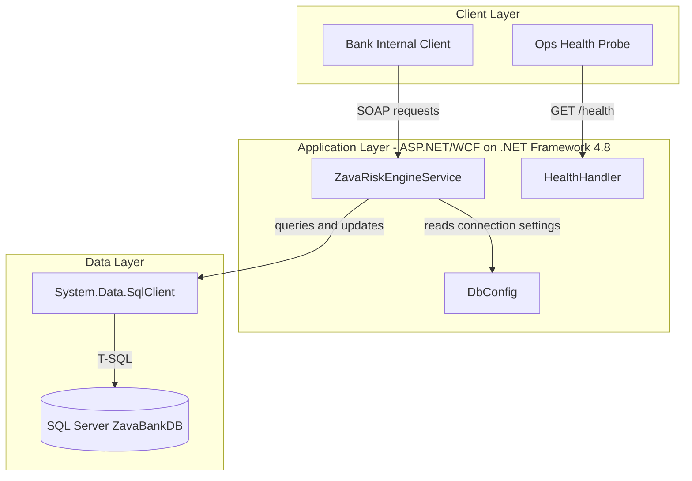
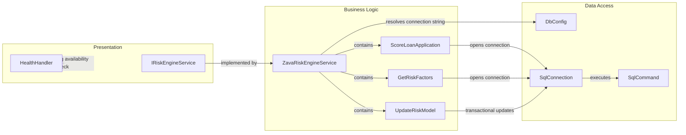

# Architecture Diagram

This .NET Framework application exposes a WCF SOAP service for loan risk scoring and uses SQL Server for persistence.

## Application Architecture

### Technology Stack Summary

| Layer | Technology | Version | Purpose |
|---|---|---|---|
| Presentation | ASP.NET Web Forms host | .NET Framework 4.8 | Hosts service endpoint and status page |
| Service | WCF (`System.ServiceModel`) | .NET Framework 4.8 | Exposes SOAP operations for risk scoring |
| Data Access | ADO.NET (`System.Data.SqlClient`) | .NET Framework 4.8 | Executes SQL statements and transactions |
| Data Store | SQL Server | Not pinned in repo | Stores loan, account, risk, and model data |

### Data Storage & External Services

The application stores and reads operational data from a single SQL Server database (`ZavaBankDB`) via direct SQL commands. No cache, queue, or third-party external API integrations were found.

### Key Architectural Decisions

- Uses a single deployable service endpoint (`basicHttpBinding`) for internal SOAP integration.
- Uses direct SQL commands in service methods rather than repository/ORM abstraction.
- Supports environment-variable overrides for DB connection settings before falling back to `web.config`.

## Component Relationships

### Component Inventory

| Component | Layer | Type | Responsibility |
|---|---|---|---|
| IRiskEngineService | Presentation | WCF Service Contract | Defines SOAP operations |
| ZavaRiskEngineService | Business Logic | Service Class | Implements scoring, factor retrieval, and model update logic |
| DbConfig | Data Access | Config Utility | Builds DB connection string from env/config |
| SqlConnection/SqlCommand | Data Access | ADO.NET API | Performs SQL read/write and transactions |
| HealthHandler | Presentation | HTTP Handler | Returns plain-text health status |
