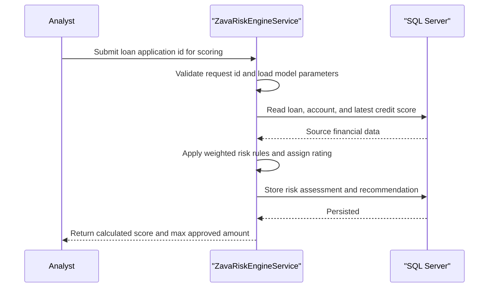

# Core Business Workflows

The application supports bank risk operations by scoring loan applications, exposing factor breakdowns, and allowing authorized model parameter updates.

## Domain Entities

| Entity | Service / Bounded Context | Description | Key Relationships |
|---|---|---|---|
| Loan Application | Risk Evaluation | Customer request to borrow funds that triggers scoring | Linked to Customer and Account |
| Risk Assessment | Risk Evaluation | Persisted result of score, rating, and recommendation | Produced from Loan Application + Customer data |
| Risk Factor | Risk Evaluation | Weighted input used to explain customer risk | Combined into overall score |
| Risk Model Parameter | Model Governance | Adjustable model coefficients and base score values | Used by scoring and maintained by model update workflow |
| Customer Account Snapshot | Risk Evaluation | Current financial context (balance, exposure, credit score) | Pulled from account and credit history records |

## Service-to-Domain Mapping

| Service | Domain Context | Owned Entities | External Dependencies |
|---|---|---|---|
| ZavaRiskEngine | Risk Evaluation + Model Governance | Risk Assessment, Risk Model Parameter, Risk Factor computations | SQL Server data tables for applications/accounts/credit |

## Primary Workflows

### Workflow 1: Loan Application Risk Scoring

Entry point is `ScoreLoanApplication(applicationId)`. The service validates input, loads loan/customer/account context, calculates weighted score and letter rating, writes an assessment record, and returns approval guidance.

### Workflow 2: Customer Risk Factor Retrieval

Entry point is `GetRiskFactors(customerId)`. The service validates input, aggregates risk metrics from customer-related tables, computes weighted impacts, and returns normalized factors plus overall score.

### Workflow 3: Risk Model Parameter Update

Entry point is `UpdateRiskModel(modelParams)`. The service validates payload presence, opens a transaction, upserts parameter rows, and returns update status.

## Cross-Service Data Flows

No multi-service composition was found. All workflow data is gathered from and written to a single SQL Server database by one service boundary.

## Business Workflow Sequence

## Business Rules & Decision Logic

- Input validation: application and customer identifiers must be greater than zero; model update requires at least one parameter.
- Scoring logic: weighted combination of normalized credit score, balance ratio, term, and requested amount plus base score.
- Decision logic: rating bands (`A` through `F`) drive approval multiplier and recommendation (`Deny` for `F`, otherwise `Review`).
- Data integrity: model parameter updates are wrapped in a SQL transaction with upsert semantics.
