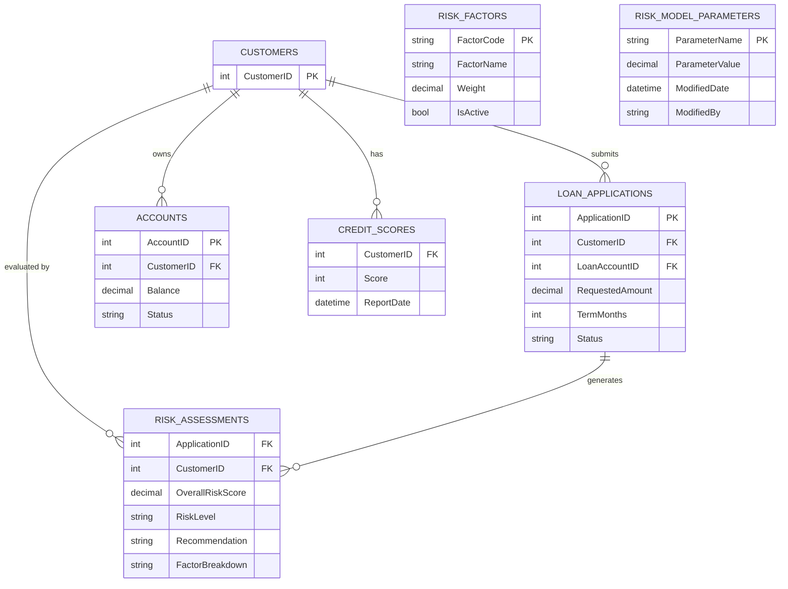

# Data Architecture & Persistence Layer

The data layer is implemented with direct ADO.NET access to a single SQL Server database and runtime-created support tables for risk model parameters.

## Database Configuration

| Service/Module | DB Type | Profile | Driver | Connection | Migration Tool |
|---|---|---|---|---|---|
| ZavaRiskEngine | SQL Server | Default / env override | `System.Data.SqlClient` | `Server=...;Database=...;User Id=...;****** from env vars or `web.config` | None detected |

## Data Ownership per Service

| Service | Tables Owned | ORM Framework | Caching | Notes |
|---|---|---|---|---|
| ZavaRiskEngine | `RiskAssessments`, `RiskModelParameters` (plus reads from `LoanApplications`, `Accounts`, `CreditScores`, `RiskFactors`) | ADO.NET (no ORM) | None | `RiskModelParameters` is created on demand if missing |

## Entity Model

## Key Repository Methods

| Service | Repository | Notable Methods | Purpose |
|---|---|---|---|
| ZavaRiskEngine | Inline SQL in `ZavaRiskEngineService.cs` | `ScoreLoanApplication` SELECT+INSERT flow | Computes and stores risk assessment for an application |
| ZavaRiskEngine | Inline SQL in `ZavaRiskEngineService.cs` | `GetRiskFactors` aggregate SELECTs | Builds factor list and overall score for a customer |
| ZavaRiskEngine | Inline SQL in `ZavaRiskEngineService.cs` | `UpdateRiskModel` upsert within transaction | Updates or inserts model parameters safely |
| ZavaRiskEngine | Inline SQL in `ZavaRiskEngineService.cs` | `EnsureRiskModelTableExists` | Initializes required table at runtime |

## Caching Strategy

No caching provider, cache regions, or cache annotations were found. All reads are served directly from SQL Server.

## Data Ownership Boundaries

The application is a single-service topology with one shared SQL Server database. Data composition occurs inside SQL statements and in-memory calculations within the same service process; no cross-service data ownership boundaries were found.

### Data Classification & Sensitivity

| Entity | Sensitive Fields | Classification (PII/PHI/PCI/None) | Controls in Place |
|---|---|---|---|
| CUSTOMERS | Name/contact/customer identifiers (inferred) | PII | No masking or encryption controls visible in repo |
| LOAN_APPLICATIONS | Requested loan amounts and status | Confidential financial | No explicit data-protection controls in repo |
| ACCOUNTS | Balance data | Confidential financial | No explicit data-protection controls in repo |
| RISK_ASSESSMENTS | Risk scores and recommendations | Confidential financial | No explicit data-protection controls in repo |
