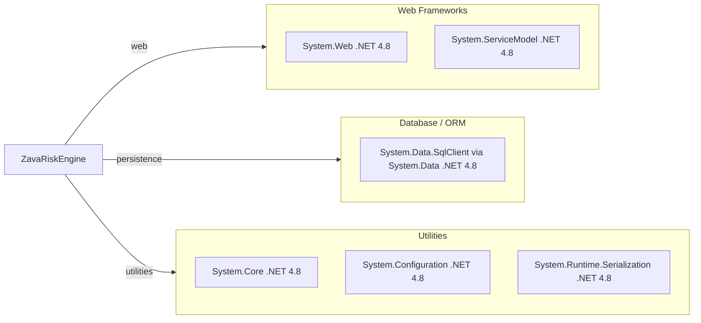

# Dependency Map

ZavaRiskEngine is a .NET Framework service with a small declared dependency surface centered on framework assemblies and SQL connectivity.

## Dependencies

### Dependency Summary

| Category | Count | Key Libraries | Notes |
|---|---:|---|---|
| Web Frameworks | 2 | System.Web, System.ServiceModel | ASP.NET host and WCF SOAP stack |
| Database / ORM | 1 | System.Data | Raw SQL via ADO.NET to SQL Server |
| Utilities | 3 | System.Core, System.Configuration, System.Runtime.Serialization | Base runtime, config, and DTO serialization |

### Version & Compatibility Risks

The project targets `.NET Framework 4.8`, which limits modern runtime/container options compared with .NET 8/10. The Dockerfile uses `mono:6.12`, which introduces compatibility and support risk for long-term modernization.

### Notable Observations

- No third-party NuGet packages are declared (`packages.config` is empty).
- Dependency management is assembly-reference based in legacy-style `.csproj` format.
- SOAP/WCF endpoint usage may require contract migration for cloud-native API gateways.

## Test Dependencies

No test dependencies detected.

Total test-scope dependencies: 0
No dedicated test framework configuration was found in the repository.
