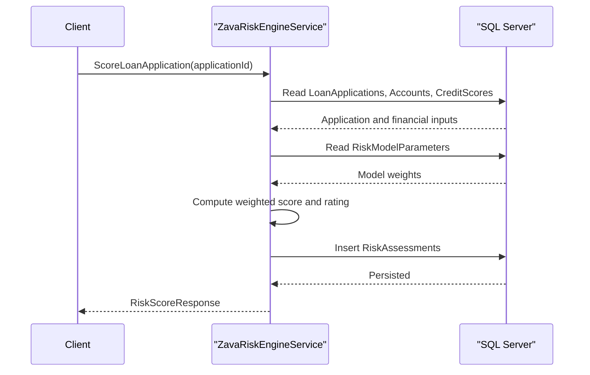

# API & Service Communication Contracts

The API surface is a single SOAP/WCF service contract with three operations plus one lightweight health endpoint. Communication is synchronous request/response over HTTP with direct database access inside service methods.

## Service Catalog

| Service | Port | Category | Purpose |
|---|---:|---|---|
| ZavaRiskEngine (WCF service) | App-host dependent (Dockerfile exposes 8080) | Business | Scores loan risk, returns risk factors, updates model parameters |
| HealthHandler endpoint | App-host dependent | Observability | Returns basic liveness response |

## API Endpoints Inventory

| Service | Method | Path | Request Type | Response Type |
|---|---|---|---|---|
| IRiskEngineService | SOAP Operation | `ScoreLoanApplication` | `int applicationId` parameter | `RiskScoreResponse` |
| IRiskEngineService | SOAP Operation | `GetRiskFactors` | `int customerId` parameter | `RiskFactorsResponse` |
| IRiskEngineService | SOAP Operation | `UpdateRiskModel` | `RiskModelUpdateRequest` | `RiskModelUpdateResponse` |
| HealthHandler | GET | `/health` | none | `text/plain` (`OK`) |

## Management & Observability Endpoints

| Service | Endpoint | Custom Metrics (if any) |
|---|---|---|
| ZavaRiskEngine | `/health` | None detected |
| ZavaRiskEngine | WCF metadata (`httpGetEnabled=true`) | None detected |

## DTOs & Contracts

The API contract uses data contracts in `RiskContracts.cs`: `RiskScoreResponse`, `RiskFactorsResponse`, `RiskFactorItem`, `RiskModelUpdateRequest`, `RiskModelParameter`, and `RiskModelUpdateResponse`. These DTOs are mutable C# classes with `DataContract`/`DataMember` attributes and are used as SOAP request/response payloads. No OpenAPI, GraphQL, or protobuf contract files were found.

## Communication Patterns

Communication is synchronous SOAP over basic HTTP binding between clients and `IRiskEngineService`. Inside each operation, the service performs synchronous SQL queries/commands against SQL Server using `SqlConnection` and `SqlCommand`; no asynchronous messaging pattern is present. Retry/circuit-breaker libraries and configured timeout policies are not declared in the repository. Security posture at contract level is minimal: there is no explicit TLS enforcement or authentication/authorization checks in code/config for service operations.

## Service Technology Matrix

| Service | Web | Data Access | Discovery | Gateway | Actuator | Cache | Metrics |
|---|---|---|---|---|---|---|---|
| ZavaRiskEngine | WCF (basicHttpBinding) | ADO.NET SqlClient | none | none | `/health` handler | none | none |

## Service Communication Sequence

