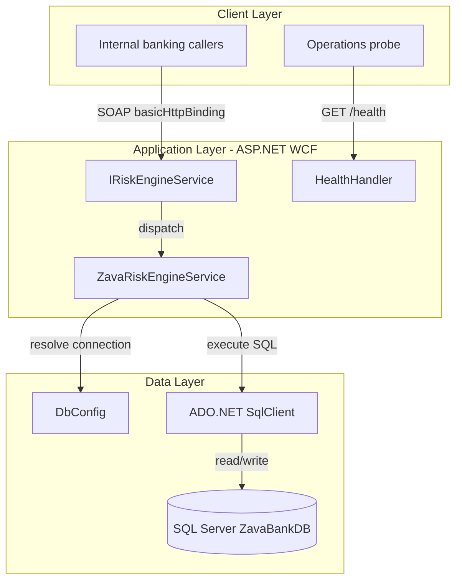
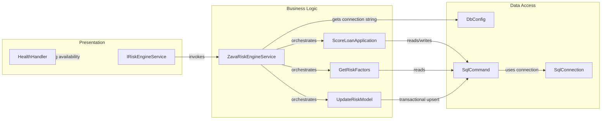

# Architecture Diagram

This application is a single .NET Framework 4.8 WCF service that exposes loan-risk scoring operations and persists risk artifacts in SQL Server. The architecture is a layered service with presentation endpoints, business scoring logic, and direct SQL-based data access.

## Application Architecture

### Technology Stack Summary

| Layer | Technology | Version | Purpose |
|---|---|---|---|
| Presentation | WCF ServiceContract + basicHttpBinding | .NET Framework 4.8 era | Expose risk scoring operations |
| Presentation | ASP.NET HttpHandler | .NET Framework 4.8 era | Lightweight health endpoint |
| Business | ZavaRiskEngineService | In-repo service class | Risk score computation and model updates |
| Data Access | ADO.NET `System.Data.SqlClient` | Framework-provided | Execute SQL queries and writes |
| Data Storage | SQL Server (`ZavaBankDB`) | Not pinned in repo | Stores loan, account, credit, risk tables |

### Data Storage & External Services

The service uses a single SQL Server database (`ZavaBankDB`) accessed via connection string settings or DB_* environment variables. No cache, message broker, or third-party remote APIs are defined in the repository.

### Key Architectural Decisions

- Uses contract-first WCF operations (`IRiskEngineService`) instead of REST controllers.
- Performs direct SQL in service methods rather than a repository/ORM abstraction.
- Includes a separate plain-text health handler (`/health`) for runtime checks.

## Component Relationships

### Component Inventory

| Component | Layer | Type | Responsibility |
|---|---|---|---|
| IRiskEngineService | Presentation | WCF service contract | Defines service operations exposed to clients |
| ZavaRiskEngineService | Business Logic | Service class | Implements scoring, factor analysis, and model updates |
| ScoreLoanApplication | Business Logic | Operation method | Calculates and persists application risk assessment |
| GetRiskFactors | Business Logic | Operation method | Computes customer-level factor breakdown |
| UpdateRiskModel | Business Logic | Operation method | Upserts model parameter weights in DB |
| DbConfig | Data Access | Config helper | Resolves connection string from env/config |
| SqlConnection/SqlCommand | Data Access | ADO.NET components | Executes SQL reads/writes against SQL Server |
| HealthHandler | Presentation | HTTP handler | Returns `OK` for health probes |
