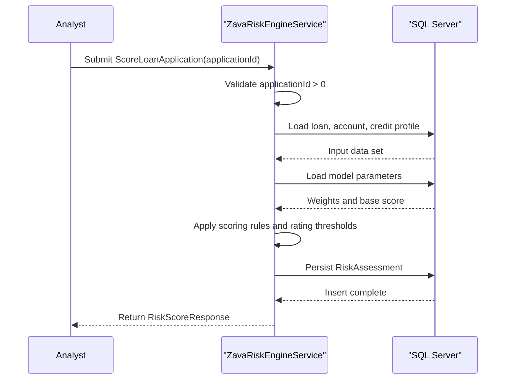

# Core Business Workflows

This application provides loan-risk evaluation workflows for banking operations, combining customer credit and account signals into risk decisions. It also supports operational model tuning by allowing risk parameter updates.

## Domain Entities

| Entity | Service / Bounded Context | Description | Key Relationships |
|---|---|---|---|
| LoanApplication | Risk Assessment | Loan request being evaluated for risk and approval ceiling | Linked to Customer and Account |
| CreditScore | Risk Assessment | Most recent borrower credit standing used in scoring | Associated to Customer |
| Account | Risk Assessment | Financial account state used to derive balance and exposure context | Associated to Customer and LoanApplication |
| RiskFactor | Risk Assessment | Metadata defining weighted factors used in score composition | Applied during factor and score computation |
| RiskModelParameter | Risk Assessment | Tunable model weights/base score maintained by operations | Consumed by scoring workflow |
| RiskAssessment | Risk Assessment | Persisted output of a risk decision | Created from LoanApplication and Customer context |

## Service-to-Domain Mapping

| Service | Domain Context | Owned Entities | External Dependencies |
|---|---|---|---|
| ZavaRiskEngineService | Credit risk decisioning | RiskAssessment, RiskModelParameter | SQL Server tables for LoanApplications, Accounts, CreditScores, RiskFactors |

## Primary Workflows

### Workflow 1: Score loan application

1. Caller submits `ScoreLoanApplication(applicationId)`.
2. Service validates input and loads loan/account/credit data.
3. Service loads model parameters and calculates weighted risk score.
4. Decision logic derives rating (`A`-`F`) and max approved amount multiplier.
5. Service persists a `RiskAssessment` record and returns `RiskScoreResponse`.

### Workflow 2: Retrieve customer risk factors

1. Caller submits `GetRiskFactors(customerId)`.
2. Service validates input and queries credit/exposure/balance/account metrics.
3. Service maps computed values to factor metadata and calculates overall weighted score.
4. Service returns `RiskFactorsResponse` with detailed factor impacts.

### Workflow 3: Update risk model parameters

1. Caller submits `UpdateRiskModel(RiskModelUpdateRequest)`.
2. Service validates payload and opens SQL transaction.
3. Service upserts each parameter row in `RiskModelParameters`.
4. Service commits transaction and returns update summary.

## Cross-Service Data Flows

No multi-service or gateway aggregation flow is implemented; workflows execute within a single service boundary and a single SQL Server store. Business degradation paths are primarily validation errors or missing-data faults returned as WCF faults.

## Business Workflow Sequence

## Business Rules & Decision Logic

- Input rules: `applicationId` and `customerId` must be greater than zero; model updates require at least one parameter.
- Score composition: weighted combination of normalized credit score, balance ratio, term length, and requested amount.
- Rating thresholds: score bands map to `A` through `F`, then to approval multipliers.
- Persistence rule: each score request writes a `RiskAssessment` audit-like record containing factor breakdown context.
- Consistency rule: model parameter updates are transactional and use upsert semantics.
