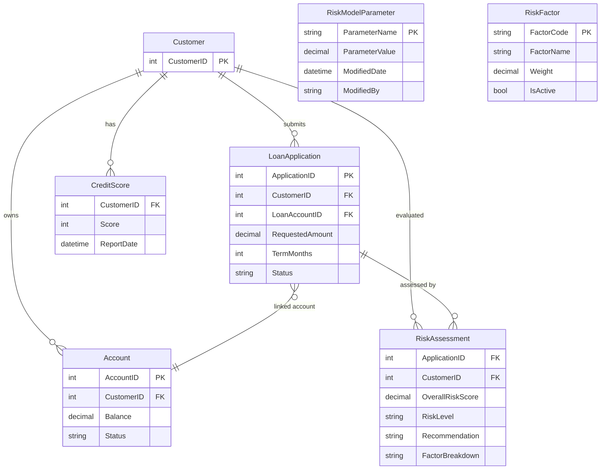

# Data Architecture & Persistence Layer

The data layer is implemented with direct ADO.NET access to SQL Server and query-driven domain models returned as SOAP data contracts. The service reads operational banking data and writes risk-assessment artifacts, with one dynamic table creation path for model parameters.

## Database Configuration

| Service/Module | DB Type | Profile | Driver | Connection | Migration Tool |
|---|---|---|---|---|---|
| ZavaRiskEngine | SQL Server | Default (`web.config`) and env override (`DB_*`) | `System.Data.SqlClient` | Connection string `ZavaBankDb` or DB env vars | None detected |

## Data Ownership per Service

| Service | Tables Owned | ORM Framework | Caching | Notes |
|---|---|---|---|---|
| ZavaRiskEngine | `RiskAssessments` (writes), `RiskModelParameters` (creates/updates) | ADO.NET SqlClient (no ORM) | None detected | Reads from `LoanApplications`, `Accounts`, `CreditScores`, `RiskFactors` |

## Entity Model

## Key Repository Methods

| Service | Repository | Notable Methods | Purpose |
|---|---|---|---|
| ZavaRiskEngine | Inline ADO.NET in `ZavaRiskEngineService.cs` | `ScoreLoanApplication(int)` | Read loan/account/credit data, compute score, insert into `RiskAssessments` |
| ZavaRiskEngine | Inline ADO.NET in `ZavaRiskEngineService.cs` | `GetRiskFactors(int)` | Aggregate customer factors from credit, exposure, and account data |
| ZavaRiskEngine | Inline ADO.NET in `ZavaRiskEngineService.cs` | `UpdateRiskModel(RiskModelUpdateRequest)` | Transactional upsert of rows in `RiskModelParameters` |
| ZavaRiskEngine | Inline ADO.NET in `ZavaRiskEngineService.cs` | `EnsureRiskModelTableExists(SqlConnection)` | Creates `RiskModelParameters` table if absent |

## Caching Strategy

No cache provider or cache-aside pattern is configured. All reads are executed directly against SQL Server in request time, and computed risk results are persisted to `RiskAssessments`.

## Data Ownership Boundaries

The application is a single service with one SQL Server data store boundary. It owns risk-computation artifacts while consuming existing customer/account/loan datasets from the same database, implying a shared-database integration pattern rather than service-isolated storage.

### Data Classification & Sensitivity

| Entity | Sensitive Fields | Classification (PII/PHI/PCI/None) | Controls in Place |
|---|---|---|---|
| Customer/Account/LoanApplication (queried) | Customer identifiers, financial balances, loan amounts | PII | No explicit masking/encryption-at-rest configuration in repo |
| RiskAssessment | Factor breakdown tied to customer/application IDs | PII | No explicit field-level protection in repo |
| RiskModelParameter | Model weights and modifier identity | None | Standard DB access only |
