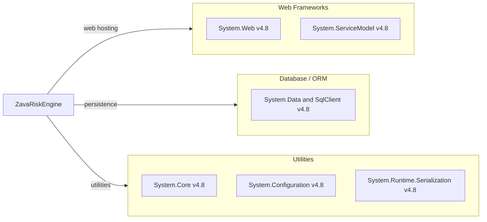

# Dependency Map

This project is a .NET Framework 4.8 service with a small declared dependency footprint and no external NuGet packages in `packages.config`. Declared dependencies are primarily framework assemblies used for WCF, ASP.NET hosting, and SQL access.

## Dependencies

### Dependency Summary

| Category | Count | Key Libraries | Notes |
|---|---:|---|---|
| Web Frameworks | 2 | System.Web, System.ServiceModel | Legacy ASP.NET + WCF stack |
| Database / ORM | 1 | System.Data (SqlClient) | Direct SQL via ADO.NET |
| Utilities | 3 | System.Core, System.Configuration, System.Runtime.Serialization | Base runtime and contracts |

### Version & Compatibility Risks

The service targets .NET Framework 4.8, which limits modernization options on Linux build agents and modern container runtimes. WCF server hosting and ASP.NET classic APIs require migration planning for future .NET versions.

### Notable Observations

- `packages.config` is empty, so dependencies are framework-bound rather than NuGet-managed.
- No explicit logging/observability/security libraries are declared.
- Data access is direct ADO.NET instead of an ORM package.

## Test Dependencies

No test-scoped dependency declarations were detected in this repository.

Total test-scope dependencies: 0
No dedicated test dependency stack is present.
